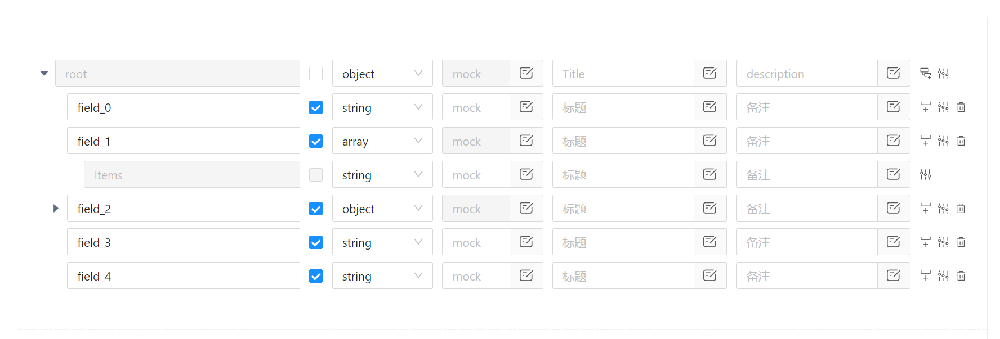

# [Json Schema 可视化编辑器](https://jokergga.github.io/jschema-editor/)

Antd Design 风格的 Json Schema 可视化编辑器。

## 示例

```shell
npm i jschema-editor
```

```typescript jsx
import Editor from 'jschema-editor';
import { useState } from 'react';

export default () => {
  const [jsonData, setJsonData] = useState({});

  return (
    <Editor
      mock={true}
      data={jsonData}
      onChange={data => {
        setJsonData(data);
      }}
    />
  );
};
```



### TODO

- [ ] IconFont 优化
- [ ] 移除 mobx
- [ ] 文档补全、及其界面优化
- [ ] 全面支持 ts
